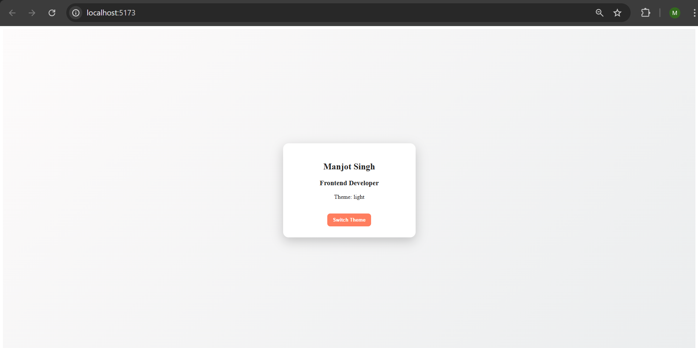
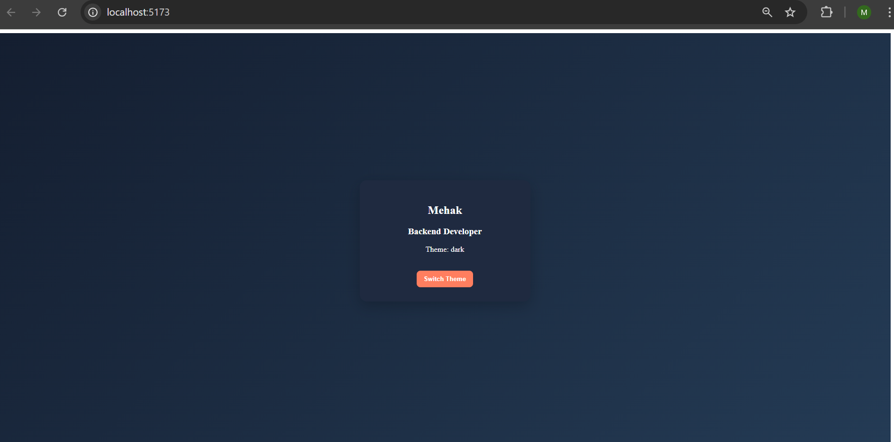
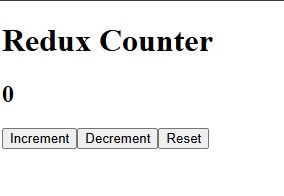
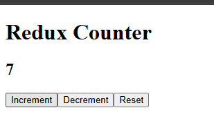
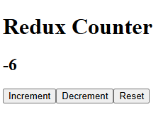

# 🚀 Experiment-4

This repository contains two React projects developed using **React + Vite**:

- 🔹 4.1 – Theme Toggle Profile Card
- 🔹 4.2 – Redux Counter Application

---

# 📂 Project Structure
---

# 🔹 4.1 – Theme Toggle Profile Card

## 📌 Description

A React application demonstrating:

- useState Hook
- Light/Dark Theme Toggle
- Conditional Styling
- Dynamic UI Updates

---

## ✨ Features

- Profile Card UI
- Displays Name & Role
- Theme Indicator
- Switch Theme Button
- Dynamic Background Change

---

## 🖼 Screenshots

### 🌞 Light Theme


### 🌙 Dark Theme


---

## 🛠 Technologies Used

- React
- Vite
- CSS
- useState Hook

---

# 🔹 4.2 – Redux Counter Application

## 📌 Description

A Redux-based counter application demonstrating global state management using **Redux Toolkit**.

---

## ✨ Features

- Counter Display
- Increment Button
- Decrement Button
- Reset Button
- Global State Management

---

## 🖼 Screenshots

### 🟢 Initial State


### 🔼 After Increment


### 🔽 After Decrement


---

# ⚙️ Installation Guide

## 🔹 Clone Repository

```bash
git clone https://github.com/manjot2952/Experiment-4.git
cd Experiment-4


